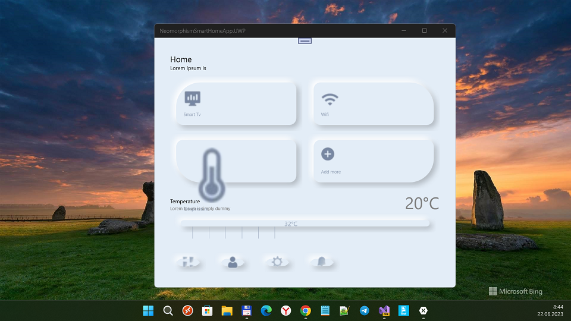

# NeomorphismSmartHomeApp

My RnD of experimental cross-platform [NeomorphismSmartHomeApp](https://github.com/felipebaltazar/NeomorphismSmartHomeApp) solution.

## Design "pattern"
 [Smart Home App UI by Amit kumar](https://dribbble.com/shots/9890579-Neomorphism-soft-UI-Design-for-Smart-Home-App)

## Used components
- [Xamarin.Forms.NeoControls v1.1.0-pre](https://github.com/felipebaltazar/Xamarin.Forms.NeoControls)
- SkiaSharp.Views.Forms v 1.68.0
- Xamarin.Forms v3.3.0.912540
- Win SDK 16299

## My 2 cents
- Xamarin.Forms src code detected & explored a little
- SkiaSharp.Views.Forms explored too :)
- UWP target added... to be continued ;) 
 
## Example of visualization (Target: UWP)

## Global plans / Global TODOs ;)
- Adapt SkiaSharp.Views.Forms v 1.68.0 to .NET Standard 1.4 :)
- Port Xamarin.Forms v3.3.0.912540 to .NET Standard 1.4 too ;)

## References
- https://github.com/felipebaltazar/NeomorphismSmartHomeApp
- https://github.com/felipebaltazar

## ..
As is. RnD only. DIY

##
[m][e] 2023